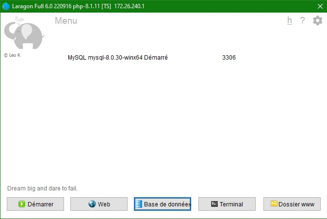

# Créer un projet Symfony 6.4 avec Composer et y installer API-platform

# Partie 1 : Installation de Symfony

```sh
# Installer symfony
composer create-project symfony/skeleton:"6.4.*" repertoire_du_projet
# Se positionner dans le répertoire du projet
cd repertoire_du_projet
```

## Installation des dépendances

```sh
# Ajout d'api-platform
composer require api
# Ajout du maker-bundle
composer require symfony/maker-bundle --dev
```

## Créer la base de données et configurer symfony pour cette base de données

Créer la base de donnée dans MySQL

Dans le fichier `.env`, décommenter la ligne correspondant à votre serveur de base de données (et commenter les autres). On utilisera ici MySQL

```sh
DATABASE_URL="mysql://root@localhost:3306/nom_base_de_donnees?serverVersion=8.0.30&charset=utf8mb4"
```
Adapter le numéro de version avec celui de votre installation MySQL sur Laragon.




## Créer une entité 

```sh
# Dans le répertoire du projet
php bin/console make:entity
# Repondre "yes" à la 1ere question (exposer l'entité sur l'API)
# Répondre aux questions de l'utilitaire (ajout des attributs)
```

## Appliquer les migrations

```sh
# Créer la migration
php bin/console make:migration
# Appliquer la migration (met à jour la base de données)
php bin/console doctrine:migrations:migrate
```

Une fois votre ou vos entités créé et migrées, lancer le serveur web de PHP

```sh
php -S localhost:3000 -t public
```

Accéder à l'application via [http://localhost:3000/api](http://localhost:3000/api)

# Partie 2 : Configurer API Platform

La configuration du bundle api-platform se fait dans le fichier `config/packages/api_platform.yaml`

[Documentation officielle: Exemple de configuration](https://api-platform.com/docs/core/configuration/)

## Définir les formats de réponse

[Documentation officielle: Les formats de réponse](https://api-platform.com/docs/core/content-negotiation/)

Par défaut, seul le format `json-ld` est disponible. Il est possible de définir d'autres formats dans la section `formats` du fichier `config/packages/api_platform.yaml`. Ci-dessous, la liste des formats supportés : 

```yml
# api/config/packages/api_platform.yaml
api_platform:
    formats:
        jsonld:   ['application/ld+json']
        jsonhal:  ['application/hal+json']
        jsonapi:  ['application/vnd.api+json']
        json:     ['application/json']
        xml:      ['application/xml', 'text/xml']
        yaml:     ['application/x-yaml']
        csv:      ['text/csv']
        myformat: ['application/vnd.myformat']
```

# Partie 3 : Personnaliser les entités exposées dans api-platform

## Définir le nom d'un attribut 

Par convention, les attributs doivent être en `camelCase`. Si un attribut ne respecte pas cette convention, Symfony exposera ledit attribut en double : 
- le nom de l'attribut défini dans l'entité
- le nom converti en camelCase

Par exemple, pour une entité `Car` possédant les attribut `car_brand`, `car_model`, `car_price`, l'api exposera le JSON suivant : 

```json
{
    "id": 1,
    "car_brand": "Renault",
    "car_model": "Clio",
    "car_price": 18000,
    "carBrand": "Renault",
    "carModel": "Clio",
    "carPrice": 18000
}
```

Pour éviter ces doublons, 2 solutions : 
- Créer l'entité avec des attributs en camelCase

ou 

- Si l'entité possède des attributs qui ne sont pas en camlCase ; configurer l'entité pour retourner directement l'attribut en camelCase. Cela se réalise directement dans l'entité en ajoutant une annotation `SerializedName` au dessus de l'attribut concerné.

Exemple : 
```php
// src/Entity/Car.php

#[ORM\Column(length: 50)]
#[SerializedName('carBrand')] 
private ?string $car_brand = null;
```

L'attribut concerné n'apparaitra plus en double dans la réponse.

## Créer une relation 1 à plusieurs entre 2 entités

A la création ou modification d'une entité, après avoir configuré tous les attributs de l'entité, ajouter un attribut qui sera de type `relation` puis choisr le bon type d'association entre "ManyToOne", "OneToMany", "ManyToMany", "OneToOne".

Une fois la relation configurée, appliquer les migrations (voir chapitre précédent).


## Définir les opérations disponibles pour une entité 

