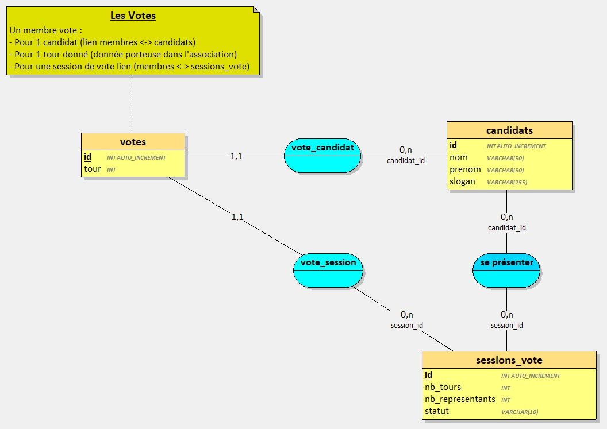
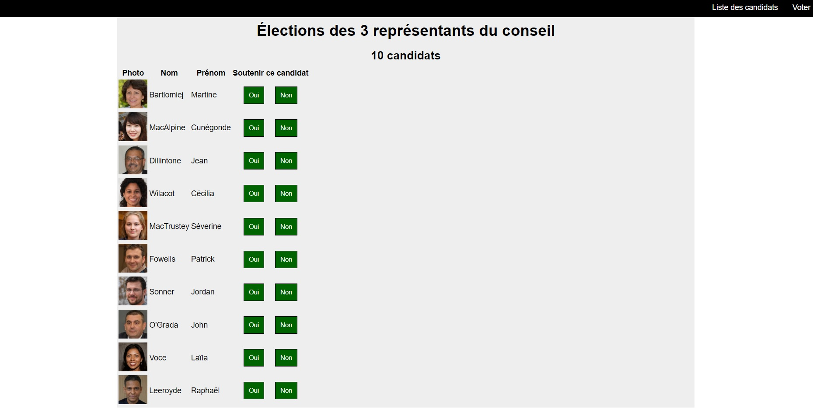

# Projet "Machine à Voter"

## Modéliser la base de données

Proposition de base de données

### MCD

### MLD

## Installation du projet : 

1. Créer la base de données (voir le fichier [db_votations.sql](./db_votations.sql))
2. Créer le répertoire du projet et s'y positionner avec un terminal
3. Créer un projet **Symfony** :  `composer create-project symfony/skeleton:"6.4.*" .`
4. Installer **api-platform** : `composer require api`
5. Installer **maker-bundle** : `composer require symfony/maker-bundle --dev`
6. Créer les entités nécessaires en vous basant sur le modèle proposé
    - Tous les entités sont exposées dans l'API
    - Les entités `candidats` et `sessions_vote` sont en lecture seule dans l'API (uniquement les opérations `GET` sont accessibles)
    - L'entité `votes` expose les opérations `GET` et `POST` uniquement

## Créer un jeu d'essai

1. Ajouter 1 session de votes à 2 tours
    - 3 représentants sont à élire
2. Ajouter 10 candidats à la session de vote.
    - Voir le dossier [public/assets/candidats](../public/assets/candidats/) pour voir la liste des candidats à ajouter ainsi que leurs portraits.

## Modéliser le logiciel client

Le logiciel client est une page web pilotée par VueJS.

### Page d'accueil d'une session de vote 

Un clic sur le bouton `voter` mène à la page suivante...

### Page permettant de voter 

- L'utilisateur sélectionne `Oui` ou `Non` pour chaque candidat.
- Tous les `Oui` sont enregistrés en base de données (les non sont ignorés).

--- 

# To be continued...
